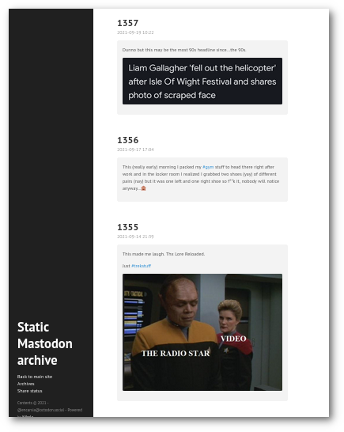
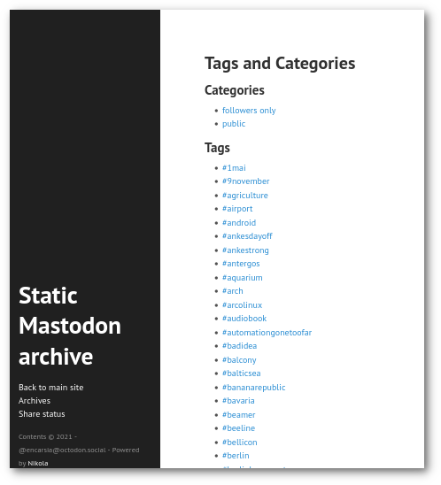

This plugin does an import of a Mastodon archive (go to *"Edit profile -> Import and Export -> Request archive"*).

Attached videos, audio files and images work as does content in general.

The output is html, and there's little to no configuration done in the resulting site.

## IMPORTANT

This plugin was inspired by my [Google+ import plugin](https://github.com/encarsia/gplus_nikola_import). It will import only posts that are not replies or boosts or direct messages.

If you consider to release this into the wilderness, keep in mind that the import includes public posts and followers only posts if enabled in the config. You can filter for hashtags (includes/excludes) and watermark images.

There is an additional Python script called ``analyze_archive.py`` that prints information about the activities stored in the archive in greater detail. Running the script will not import anything.

Enjoy.

## USAGE

 * Request, download and unpack your Mastodon archive.
 * Copy the extracted plugin archive folder into the ``plugins`` folder of an existing Nikola site.
    * Chances are that there isn't a ``plugins`` folder yet. Create it.
    * The plugin will create a new site in a subfolder so there won't be any contaminations with actual data.
    * If you are unsure or don't want that you can easily initiate an empty site for that purpose: ``$ nikola init dummy_site``.
 * Edit ``plugins/import_mastodon/config.yaml`` to your needs:
    * title/description/link to website etc.
    * include your replies to own posts; this may be useful if you tend to chain multiple posts regarting one topic; defaults to *no/False*
    * include links to the original posts (if you move or delete your account these will be deadlinks, of course; recommended only if you consider this static archive as a form of backup with original posts still available)
    * filtering tags:
        * setting included hashtags will only import posts with defined tags
        * setting excluded hashtags will import all posts except those with defined tags
        * setting both will only consider the includes, of course 
    * set ``watermark`` to *yes/True* to mark images with a horizontal text line (``watermark_text``)
 * It is convenient to move the archive folder to the Mastodon plugin folder. If not you just have to give its path when running the Nikola import.
 * Run ``$ nikola import_mastodon (path/to/)archive/``.
 * There is some information regarding the archive and imported posts printed to the console.
 * The plugin inits a new Nikola site called ``new_site``. You have to change into that directory to run build commands: ``$ cd new_site``.
 * You can specify a custom output folder name by using the option ``-o``:
   ``$ nikola import_mastodon -o my_archive (path/to/)archive/``.
 * Although the output should work with any theme, it looks quite nice with [hyde](https://themes.getnikola.com/v7/hyde/); hpstr is okay, too.
   Install hyde: ``$ nikola theme -i hyde``.
 * Consider to copy the included ``custom.css`` into the ``themes/THEME_NAME/assets/css`` directory for an even better result.
 * Tweaking ``conf.py``:
   * reduce image file size:
     * width: ``MAX_IMAGE_SIZE = 500`` (default 1280)
     * thumbnail: ``IMAGE_THUMBNAIL_SIZE = 200`` (default 400)
   * set link(s) to your main presence or profiles: ``NAVIGATION_LINKS``
   * number of posts per index page: ``INDEX_DISPLAY_POST_COUNT = 20`` (plugin default 30)
 * Build the site: ``$ nikola build``.
 * Watch the site on localhost:8000: ``$ nikola serve``.

## ANALYZE_ARCHIVE.PY

* The script is an executable Python script that you can run by
  ``$ ./analyze_mastodon.py path/to/archive/``

* Information printed to the console regarding
  * overall posts
  * boosted users
  * replied profiles
  * replies to profiles that are no longer available (profiles may be deleted or moved, or are muted/suspended or on muted/suspended instances on your instance)
  * broken conversations (original post of the reply is probably deleted, some users auto-delete old posts so this is probably a common phenomenon).
   * publishing year
   * hashtags
   * likes
   * media attachments

* The script asks you if you want to check the availability of profiles with the most interactions. This process may take a while.

## KNOWN ISSUES

* As Mastdodon as a microblogging platform doesn't support titles, these are just ascending numbers.
* If you re-run the import with an altered configuration you should delete the ``posts/`` folder because files are only replaced and added not deleted. Otherwise there may be posts included that were not meant to be there by a current configuration.
 
## EXAMPLE OUTPUT

### import plugin

```console
Your Mastodon archive in numbers
~~~~~~~~~~~~~~~~~~~~~~~~~~~~~~~~
total number of toots: 4534
among them boosts: 237

********************************************************

public posts: 3935
followers only posts: 308
direct messages: 35

********************************************************

original toots: 2320
among them (probably) orphaned replies: 1149
replies: 1958
posts with hashtags: 579

********************************************************

number of toots to be imported: 1381
among them posted 'followers only' (needs config): 1
among them replies to own posts (needs config): 210

```


### static site

#### index page



#### tag page



### analyze script

```console
┌──────────────────────────────┐
│   Mastodon archive summary   │
└──────────────────────────────┘

total number of toots: 4534
among them boosts: 237

********************************************************

most boosted users (10)
~~~~~~~~~~~~~~~~~~~~~~~
[...]

boosted users (total): 99

********************************************************

public posts: 5678
followers only posts: 456
direct messages: 45

********************************************************

original toots: 1234
among them orphaned replies: 456
replies: 789
posts with hashtags: 123

********************************************************

most replied profiles (20)
~~~~~~~~~~~~~~~~~~~~~~~~~~
[...]

replied users (total): 456

most replied profiles that are no longer available (20)
~~~~~~~~~~~~~~~~~~~~~~~~~~~~~~~~~~~~~~~~~~~~~~~~~~~~~~~
[...]
replied users (total): 34

profiles with broken conversations (20)
~~~~~~~~~~~~~~~~~~~~~~~~~~~~~~~~~~~~~~~
[...]

replied users (total): 12

********************************************************

publishing year
~~~~~~~~~~~~~~~~
2017:    12
2018:   123
[...]

********************************************************

popular hashtags (25)
~~~~~~~~~~~~~~~~~~~~~
[...]

hashtags (total): 123

********************************************************

likes
~~~~~
total: 8901
liked posts by platform:
  6789: Mastodon
   987: Pleroma
[...]

********************************************************

most liked Mastodon profiles (50)
~~~~~~~~~~~~~~~~~~~~~~~~~~~~~~~~~
[...]

liked profiles (total): 1234

********************************************************

number of media attachments: 123
media files by type:
[...]

********************************************************

Do you want to check if your most frequently boosted profiles (50) are currently up? This may take a while... (y/N)> 

```
